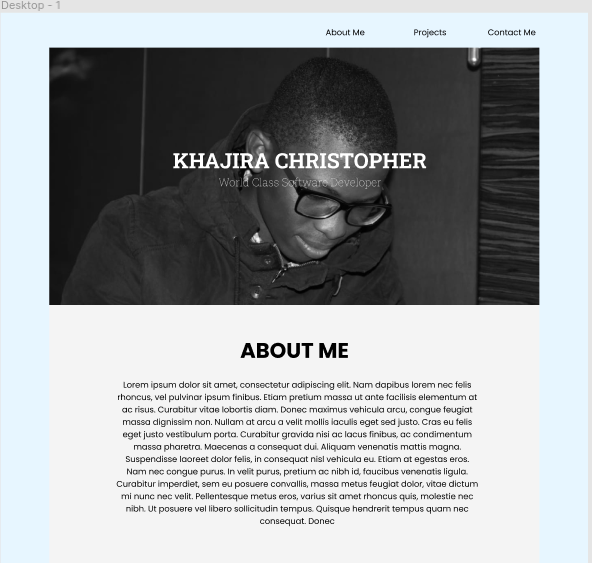
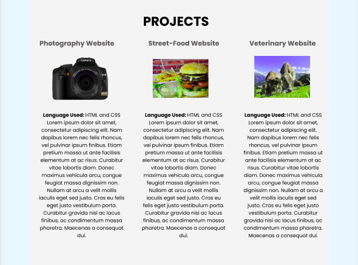
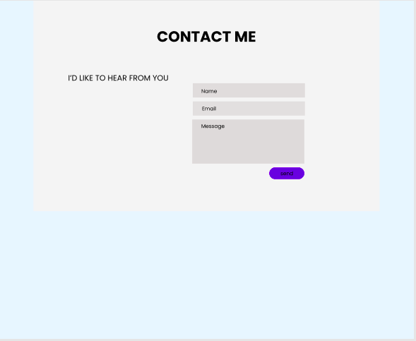

## Portfolio Website

This is a site to display my portfolio, 29/08/2021

By Khajira Christopher

## Description

The purpose of the portfolio website to display my skills. The site contains three sections; the about me, projects and contact me. 

## Setup/Installation Requirements
1. Clone the project using git -clone . If you are not able to clone it, you can download the files as a zip folder

2. Ensure that you have the complete file

3. Navigate to the index.html file which is in the root file of the folder. The application is static and only uses HTML and CSS 

4. Copy the path of the index.html file to your browser and you will be able to access the application.

## Technologies Used
This project uses HTML and CSS.
## Support and contact details
If you have any issues or questions, you can get intouch with me through email: christopher.khajira@student.moringaschool.com. Please feel free to make any contributions to the code.

## Design Diagrams
Landing Page

### License
MIT License
Copyright (c) 2021 Khajira Christopher
